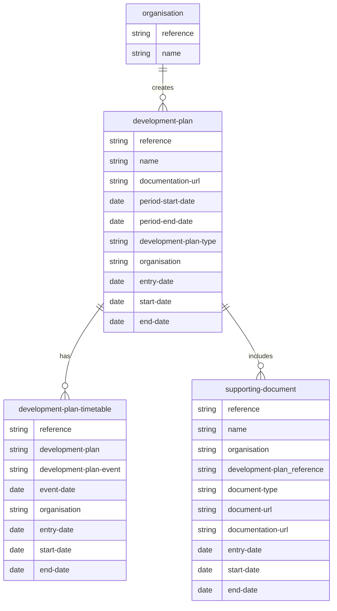

```mermaid
erDiagram
    organisation {
        string reference
        string name
    }
    development-plan {
        string reference
        string name
        string documentation-url
        date period-start-date
        date period-end-date
        string development-plan-type
        string organisation
        date entry-date
        date start-date
        date end-date
    }
    development-plan-timetable {
        string reference
        string development-plan
        string development-plan-event
        date event-date
        string organisation
        date entry-date
        date start-date
        date end-date
    }
    supporting-document {
        string reference
        string name
        string organisation
        string development-plan_reference
        string document-type
        string document-url
        string documentation-url
        date entry-date
        date start-date
        date end-date
    }
    organisation ||--o{ development-plan : creates
    development-plan ||--o{ development-plan-timetable : has
    development-plan ||--o{ supporting-document : includes
```
