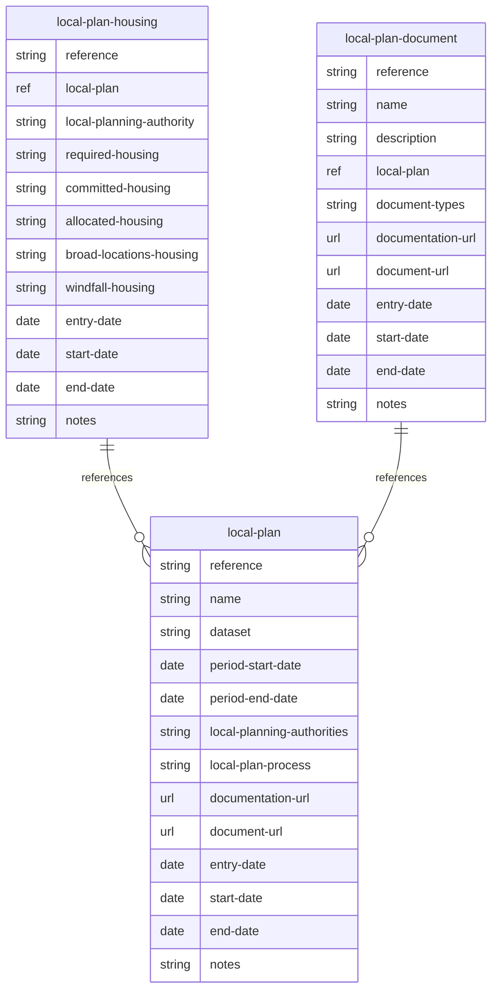

```mermaid
erDiagram
    local-plan {
        string reference
        string name
        string dataset
        date period-start-date
        date period-end-date
        string local-planning-authorities
        string local-plan-process
        url documentation-url
        url document-url
        date entry-date
        date start-date
        date end-date
        string notes
    }
    local-plan-housing {
        string reference
        ref local-plan
        string local-planning-authority
        string required-housing
        string committed-housing
        string allocated-housing
        string broad-locations-housing
        string windfall-housing
        date entry-date
        date start-date
        date end-date
        string notes
    }
    local-plan-document {
        string reference
        string name
        string description
        ref local-plan
        string document-types
        url documentation-url
        url document-url
        date entry-date
        date start-date
        date end-date
        string notes
    }
    local-plan-housing ||--o{ local-plan : references
    local-plan-document ||--o{ local-plan : references
```
