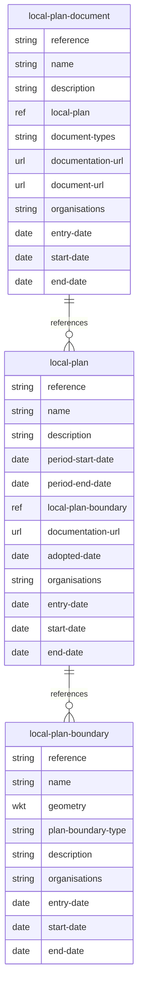

```mermaid
erDiagram
    local-plan-boundary {
        string reference
        string name
        wkt geometry
        string plan-boundary-type
        string description
        string organisations
        date entry-date
        date start-date
        date end-date
    }
    local-plan {
        string reference
        string name
        string description
        date period-start-date
        date period-end-date
        ref local-plan-boundary
        url documentation-url
        date adopted-date
        string organisations
        date entry-date
        date start-date
        date end-date
    }
    local-plan-document {
        string reference
        string name
        string description
        ref local-plan
        string document-types
        url documentation-url
        url document-url
        string organisations
        date entry-date
        date start-date
        date end-date
    }
    local-plan ||--o{ local-plan-boundary : references
    local-plan-document ||--o{ local-plan : references
```
