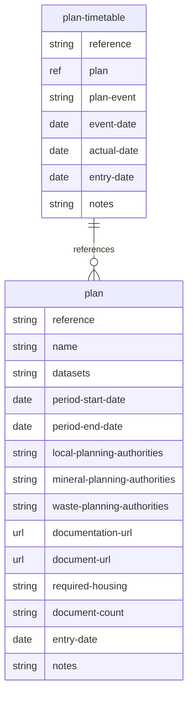

```mermaid
erDiagram
    plan {
        string reference
        string name
        string datasets
        date period-start-date
        date period-end-date
        string local-planning-authorities
        string mineral-planning-authorities
        string waste-planning-authorities
        url documentation-url
        url document-url
        string required-housing
        string document-count
        date entry-date
        string notes
    }
    plan-timetable {
        string reference
        ref plan
        string plan-event
        date event-date
        date actual-date
        date entry-date
        string notes
    }
    plan-timetable ||--o{ plan : references
```
