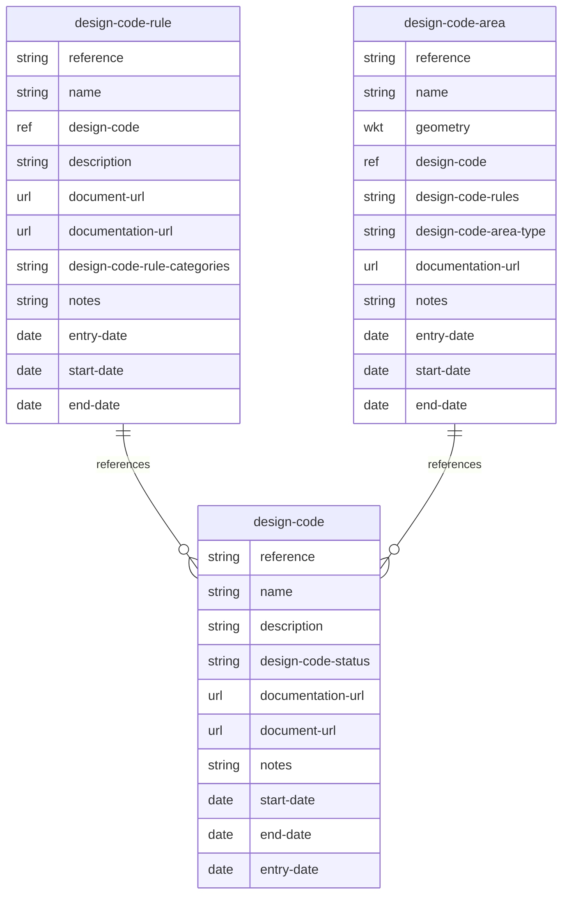

```mermaid
erDiagram
    design-code {
        string reference
        string name
        string description
        string design-code-status
        url documentation-url
        url document-url
        string notes
        date start-date
        date end-date
        date entry-date
    }
    design-code-rule {
        string reference
        string name
        ref design-code
        string description
        url document-url
        url documentation-url
        string design-code-rule-categories
        string notes
        date entry-date
        date start-date
        date end-date
    }
    design-code-area {
        string reference
        string name
        wkt geometry
        ref design-code
        string design-code-rules
        string design-code-area-type
        url documentation-url
        string notes
        date entry-date
        date start-date
        date end-date
    }
    design-code-rule ||--o{ design-code : references
    design-code-area ||--o{ design-code : references
```
