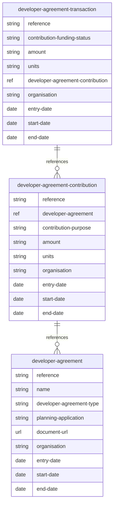

```mermaid
erDiagram
    developer-agreement {
        string reference
        string name
        string developer-agreement-type
        string planning-application
        url document-url
        string organisation
        date entry-date
        date start-date
        date end-date
    }
    developer-agreement-contribution {
        string reference
        ref developer-agreement
        string contribution-purpose
        string amount
        string units
        string organisation
        date entry-date
        date start-date
        date end-date
    }
    developer-agreement-transaction {
        string reference
        string contribution-funding-status
        string amount
        string units
        ref developer-agreement-contribution
        string organisation
        date entry-date
        date start-date
        date end-date
    }
    developer-agreement-contribution ||--o{ developer-agreement : references
    developer-agreement-transaction ||--o{ developer-agreement-contribution : references
```
