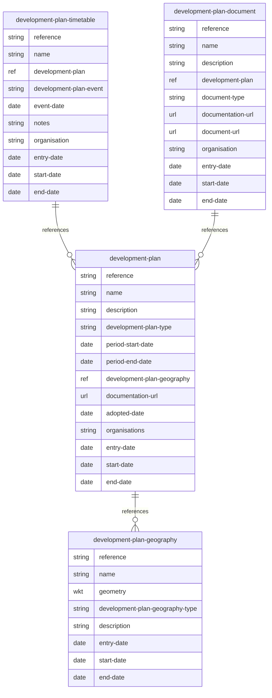

```mermaid
erDiagram
    development-plan {
        string reference
        string name
        string description
        string development-plan-type
        date period-start-date
        date period-end-date
        ref development-plan-geography
        url documentation-url
        date adopted-date
        string organisations
        date entry-date
        date start-date
        date end-date
    }
    development-plan-timetable {
        string reference
        string name
        ref development-plan
        string development-plan-event
        date event-date
        string notes
        string organisation
        date entry-date
        date start-date
        date end-date
    }
    development-plan-document {
        string reference
        string name
        string description
        ref development-plan
        string document-type
        url documentation-url
        url document-url
        string organisation
        date entry-date
        date start-date
        date end-date
    }
    development-plan-geography {
        string reference
        string name
        wkt geometry
        string development-plan-geography-type
        string description
        date entry-date
        date start-date
        date end-date
    }
    development-plan ||--o{ development-plan-geography : references
    development-plan-timetable ||--o{ development-plan : references
    development-plan-document ||--o{ development-plan : references
```
