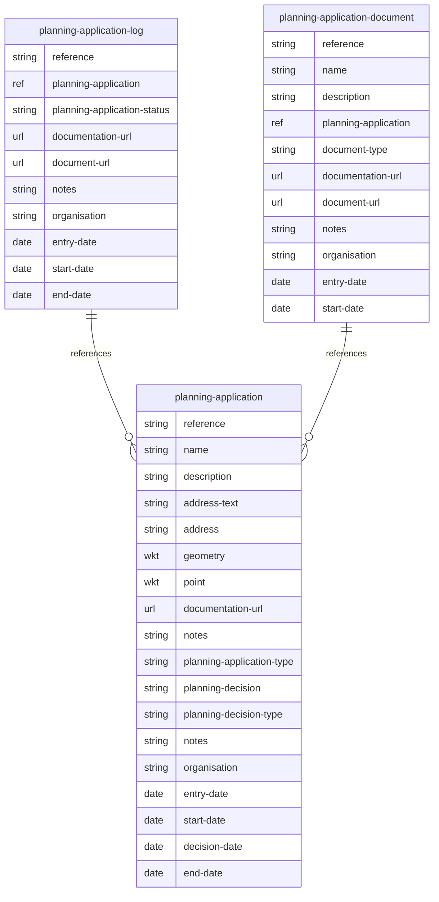

```mermaid
erDiagram
    planning-application {
        string reference
        string name
        string description
        string address-text
        string address
        wkt geometry
        wkt point
        url documentation-url
        string notes
        string planning-application-type
        string planning-decision
        string planning-decision-type
        string notes
        string organisation
        date entry-date
        date start-date
        date decision-date
        date end-date
    }
    planning-application-log {
        string reference
        ref planning-application
        string planning-application-status
        url documentation-url
        url document-url
        string notes
        string organisation
        date entry-date
        date start-date
        date end-date
    }
    planning-application-document {
        string reference
        string name
        string description
        ref planning-application
        string document-type
        url documentation-url
        url document-url
        string notes
        string organisation
        date entry-date
        date start-date
    }
    planning-application-log ||--o{ planning-application : references
    planning-application-document ||--o{ planning-application : references
```
